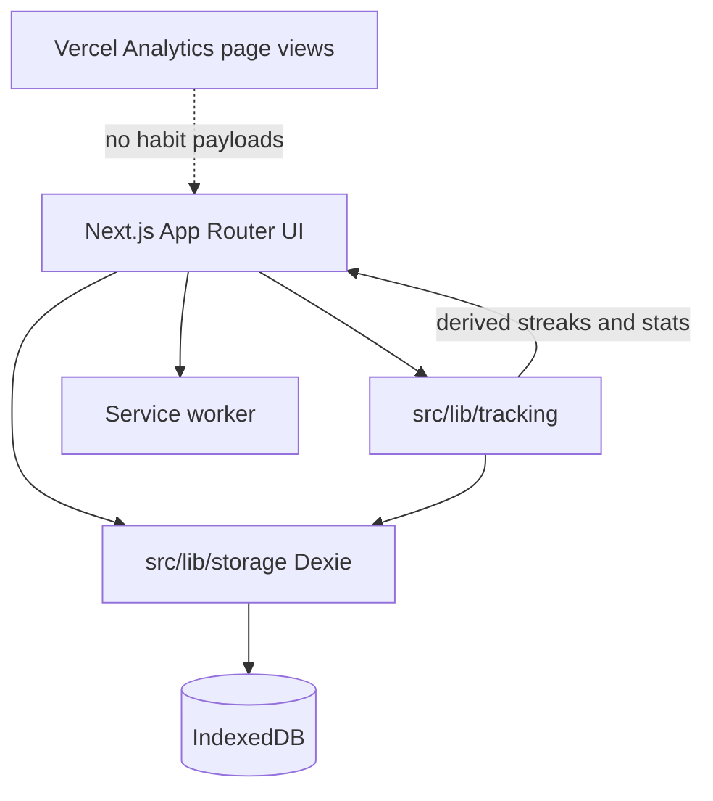
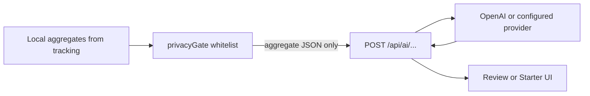

# HabitCheck — Architecture Notes (v1.0)

**Series:** AI in Action #4  
**Status:** Discovery  
**App target:** `habitcheck.weidong-shi.com` (Vercel)  
**Repo (planned):** single public Next.js app under `weidong808` (name TBD at scaffold)  
**Related:** [habitcheck.md](./habitcheck.md) · [discovery brief](../docs/discovery/habitcheck-00-discovery-brief.md) · [product decisions](../docs/discovery/habitcheck-01-product-decisions.md)

---

## 1. Goals

1. Ship a production local-first habit PWA without premature platform work.
2. Isolate schedule / streak / stats logic in a pure, unit-tested module.
3. Leave a clean seam for later extract to `@better-living/tracking` and v1.1 AI.

## 2. Non-goals (v1.0)

- Turborepo or multi-app monorepo
- Cloud sync, accounts, multi-device
- LLM calls (see §7 for v1.1 preview only)

---

## 3. System context



**One rule:** streaks and stats are **derived, never persisted**. Completions and habit definitions are the source of truth.

---

## 4. Module boundaries

| Module | Responsibility | Must not |
|--------|----------------|----------|
| `src/lib/tracking/` | Schedule evaluation, grace streaks, weekly %, heatmap series, trend helpers | Touch Dexie or React |
| `src/lib/storage/` | Dexie schema, migrations, CRUD, export/import | Encode streak formulas |
| `src/components/` + `src/app/` | UX, PWA shell, Privacy, reminders wiring | Duplicate tracking math |
| Service worker | Caching + notification display | Own business rules |

Tracking inputs: immutable habit + completion snapshots + “as of” local date. Outputs: plain data structures for UI.

---

## 5. Data model

```ts
type HabitType = "build" | "break";

type Schedule =
  | { kind: "daily" }
  | { kind: "weekly"; target: number } // 1–7
  | { kind: "weekdays"; days: number[] }; // 0=Mon .. 6=Sun (product decision)

type Habit = {
  id: string;
  name: string;
  type: HabitType;
  icon: string;
  color: string;
  motivation?: string;
  schedule: Schedule;
  createdAt: string; // ISO
  archivedAt?: string;
};

type CompletionStatus = "done" | "skipped" | "missed";

type Completion = {
  id: string;
  habitId: string;
  date: string; // YYYY-MM-DD local
  status: CompletionStatus;
  note?: string;
  loggedAt: string;
};

type Settings = {
  theme: "system" | "light" | "dark";
  remindersEnabled: boolean;
  // per-habit reminder prefs live with habit or settings map
};
```

Export envelope: `habitcheck-export@1` — `{ version, exportedAt, habits, completions, settings }`.

---

## 6. Offline and PWA

- Installable PWA; app shell + static assets cached
- Core check-off works offline (100% of v1.0 product)
- Reminders: notification permission + scheduled local notifications when platform allows
- iOS limitations documented in UI and Privacy page

---

## 7. v1.1 AI trust boundary (preview only)

When Weekly Review / Habit Starter ship:



**Rules (future):**

- Opt-in per invocation
- `privacyGate()` is the only path that may leave the device
- Versioned prompts in-repo; cost caps; cache by stats hash for Weekly Review
- Fail closed to stats-only / non-AI proposal if the model fails
- Never send raw completion notes or free-text journals in v1.1 unless explicitly product-approved later

Do **not** implement this path in v1.0.

---

## 8. Stack and delivery

| Layer | Choice |
|-------|--------|
| UI | Next.js App Router, TypeScript, Tailwind v4, `next-themes` |
| Storage | Dexie / IndexedDB |
| Tests | Vitest for `tracking` (primary); component tests as needed |
| CI | GitHub Actions: lint, typecheck, test, build |
| Host | Vercel + Cloudflare DNS for `habitcheck.weidong-shi.com` |
| Trust | `/privacy` page; wellness disclaimer; Analytics disclosure |

Chrome parity with sibling apps: skip link, touch targets, Privacy in nav/footer.

---

## 9. Suggested first implementation slices

1. Dexie schema + export/import stub  
2. `tracking` unit tests for schedules + grace streaks (red → green)  
3. Habit CRUD + today check-off  
4. Heatmap + weekly %  
5. PWA + reminders + Privacy + CI + domain  

---

## 10. Open items for scaffold time (non-blocking)

- Exact GitHub repo name (`habitcheck` vs `HabitCheck`)
- Icon / color token set
- Whether starter habits are hard-coded templates (no AI) on first run
