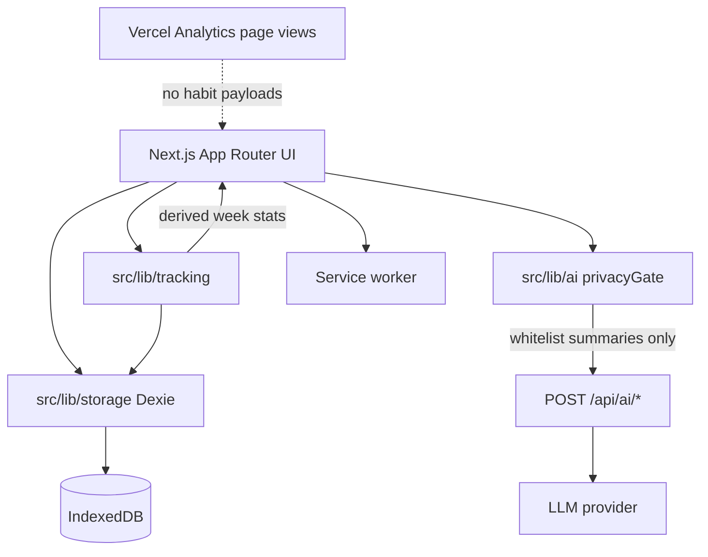
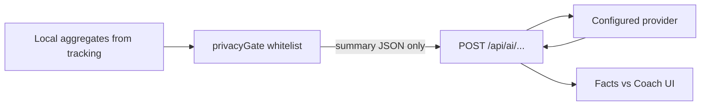

# HabitCheck — Architecture Notes (v1.0)

**Series:** AI in Action #4  
**Status:** Discovery complete · implementation-ready (MVP **v5 AI-forward**)  
**App target:** `habitcheck.weidong-shi.com` (Vercel)  
**Repo (planned):** single public Next.js app under `weidong808`  
**Related:** [habitcheck.md](./habitcheck.md) · [MVP spec v5](../docs/discovery/habitcheck-02-mvp-specification.md) · [product decisions](../docs/discovery/habitcheck-01-product-decisions.md)

---

## 1. Goals

1. Ship a local-first weekly habit PWA with kind recovery.
2. Isolate week / at-risk / consistency / easy-difficult / recovery rules in a pure tested module.
3. Ship a **first-class AI coach platform** in v1: Starter, Comeback Coach, Weekly Review cards, Plan Adjuster, Smart smaller-version — privacy gate, streaming, evals, Facts vs Coach (Readiness discipline, consumer OS posture).

## 2. Non-goals (v1.0)

- Turborepo or multi-app monorepo
- Cloud sync, accounts, multi-device
- Chat UI or full-history model payloads
- Break-habits / weekday-specific schedules

---

## 3. System context

**Rules:**

- Completions + habit definitions + recovery events are source of truth.
- Consistency, miss/met, at-risk, easy/difficult labels are **derived**.
- Model never writes scores; UI applies accept/edit/dismiss only.

---

## 4. Module boundaries

| Module | Responsibility | Must not |
|--------|----------------|----------|
| `src/lib/tracking/` | Week bounds, met/missed, at-risk, consistency %, easy/difficult, recovery completion helpers | Touch Dexie, React, or fetch |
| `src/lib/storage/` | Dexie schema, migrations, CRUD, export/import | Encode scoring formulas |
| `src/lib/ai/` | privacyGate, prompt versions, feature clients, cost/error handling | Bypass gate; send raw history |
| `src/app/api/ai/*` | Server provider calls, caps | Accept non-gated client payloads without server-side shape checks |
| UI + SW | UX, PWA, reminders | Duplicate tracking math |

---

## 5. Data model (summary)

See MVP spec §4 for full TypeScript shapes. Core entities:

- `Habit` — weeklyTarget, pendingWeeklyTarget, smallerVersion, pause, reminder, status
- `CheckIn` — done/skip, optional difficulty, `countsTowardTarget`, optional `recoveryEventId`
- `RecoveryEvent` — kind + status (`selected` \| `completed` \| `dismissed` \| `expired`) + `scheduledFor` / `linkedCheckInId`
- `Settings` — theme, reminders, aiEnabled
- Export: `habitcheck-export@2`
- Week status includes `partially_paused`; target changes apply next Monday (see MVP spec v4)

---

## 6. Offline and PWA

- Installable PWA; offline check-in and review **stats**
- AI CTAs disabled or fail closed offline
- Reminders: permission + SW when supported; pause-end reminder required by product
- iOS limits documented in UI + Privacy

---

## 7. AI trust boundary (v1.0 — first-class)

**Enforced:**

- Opt-in per invocation (+ master aiEnabled)
- Aggregates / structured fields only (MVP spec v5 §6)
- Versioned prompts; cost caps; streaming for Starter/Review; eval fixtures
- Fail closed to Facts-only flows
- No free chat; no auto-apply; model cannot set unrestricted targets
- UI always separates **Facts** (tracking) from **Coach** (model)

Reuse patterns from Readiness where practical (gate, caps, prompt versioning) — consumer coach UX, not enterprise gates.

---

## 8. Stack and delivery

| Layer | Choice |
|-------|--------|
| UI | Next.js App Router, TypeScript, Tailwind v4, `next-themes` |
| Storage | Dexie / IndexedDB |
| Tests | Vitest for `tracking` (primary) |
| CI | GitHub Actions: lint, typecheck, test, build |
| Host | Vercel + Cloudflare DNS |
| Trust | `/privacy`; wellness disclaimer; AI disclosure |

---

## 9. Implementation slices

Follow MVP phases P0–P7 in [habitcheck-02-mvp-specification.md](../docs/discovery/habitcheck-02-mvp-specification.md).

Suggested order: storage → tracking tests → Today → recovery/pause → Facts review/±1 → AI platform → all coach features → polish.

---

## 10. Open at scaffold

- Exact GitHub repo name
- Provider env (align with Readiness where possible)
- Icon / color tokens (wellness, non-generic-AI palette)
