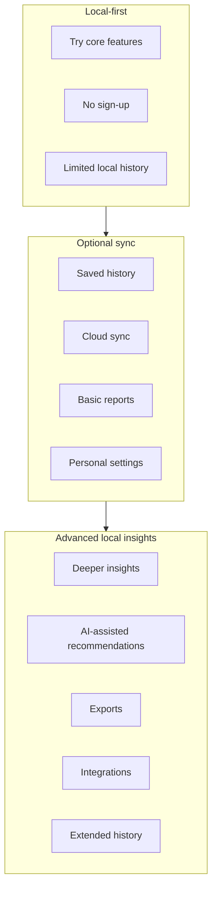

# Diagram — Capability Levels

Conceptual capability model. Today’s live apps are primarily **local-first**.

## Notes

- Optional identity is an engineering learning milestone, not a commercial gate.  
- Advanced insights are learning themes after feedback shows they matter.  
- Detailed matrices: [../docs/capability-maturity.md](../docs/capability-maturity.md).

## Related

- [../docs/authentication-strategy.md](../docs/authentication-strategy.md)
- [../docs/scope.md](../docs/scope.md)
