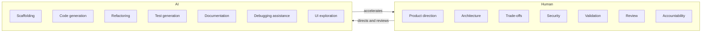
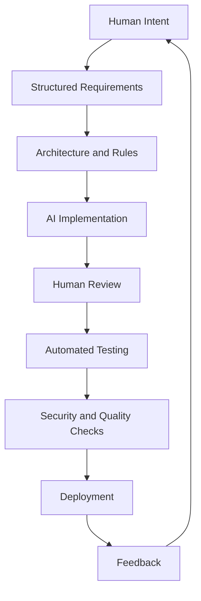

# Diagram — Human and AI Responsibilities

AI changes where engineers spend time. Accountability stays human.

## Workflow

## Guardrails (short)

- Do not trust AI output without review  
- Do not remove tests to make builds pass  
- Do not place domain logic in UI because generation was convenient  
- Do not invent APIs or weaken authorization  

Full agent brief: [../AGENTS.md](../AGENTS.md).
