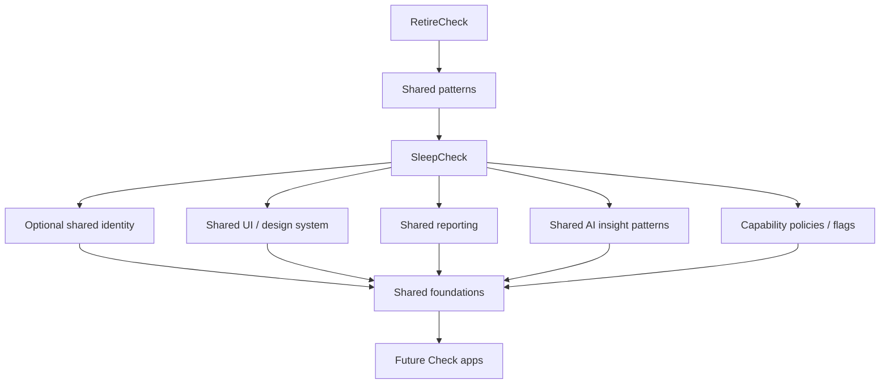

# Diagram — Platform Evolution

Incremental path from independent apps to shared technical foundations. Do not treat the bottom box as already built.

## Reading guide

| Stage | Meaning |
|-------|---------|
| RetireCheck | First live educational case study |
| Shared patterns | Conventions, docs, some UI/theme ideas — not necessarily packages yet |
| SleepCheck | Second live case study; proves reuse thinking |
| Shared capabilities | Introduced when duplication and learning goals justify them |
| Shared foundations | Cross-app identity patterns, policies, insights, dashboard |
| Future apps | FitnessCheck, NutritionCheck, MindCheck, HealthCheck, … |

## Related

- [../docs/platform-architecture.md](../docs/platform-architecture.md)
- [../docs/application-roadmap.md](../docs/application-roadmap.md)
- [target-architecture.md](./target-architecture.md)
