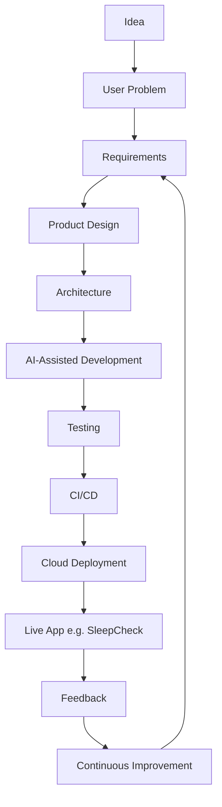

# Diagram — Product Journey

How an AI in Action application moves from idea to feedback loop. Used for SleepCheck (and reusable for future apps).

## Narrative

1. Start from a real user problem, not a technology demo.  
2. Capture requirements and product boundaries (especially wellness vs medical).  
3. Architecture and project rules precede bulk generation.  
4. AI accelerates implementation; humans own trade-offs and review.  
5. Tests, CI/CD, and cloud deployment make it “real.”  
6. Feedback drives the next improve cycle — not a big redesign by default.

## Related

- [human-ai-responsibilities.md](./human-ai-responsibilities.md)
- [../docs/content-strategy.md](../docs/content-strategy.md)
