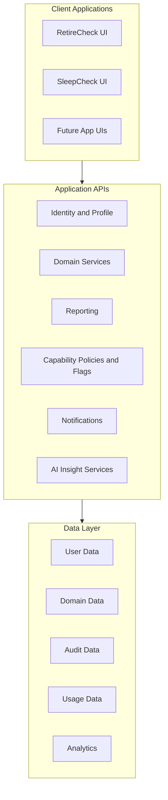

# Diagram — Target Architecture

Logical target for shared AI in Action technical foundations. **Not** a claim of current deployment topology.

## Boundary rules

| Layer | Owns | Must not |
|-------|------|----------|
| UI | Presentation, local UX state | Critical domain rules, capability enforcement |
| Domain services | Business rules, calculations | Silent policy bypass |
| Capability policies | Access decisions | Hard-coded only in components |
| AI insights | Assistive outputs | Unvalidated control of critical logic |
| Data | Persistence, retention | Silent PII sprawl |

## Related

- [../docs/platform-architecture.md](../docs/platform-architecture.md)
- [platform-evolution.md](./platform-evolution.md)
- [../docs/scope.md](../docs/scope.md)
